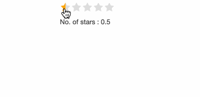

# shinyRatings

[](https://app.codecov.io/gh/shahronak47/shinyRatings?branch=master)

Have you ever needed a way to review things in `shiny` ? Look no further, as `shinyRatings` package is built to make this process very easy. It is also possible to give 1/2 stars. 

```
library(shiny)
library(shinyRatings)

ui <- fluidPage(
  shinyRatings('star'), 
  textOutput('text')
)

server <- function(input, output, session) {
  output$text <- renderText({paste("No. of stars : ", input$star)})
}

shinyApp(ui, server)
```



---

# Installation

To install the package you can use -

```
devtools::install_github('shahronak47/shinyRatings')
```
